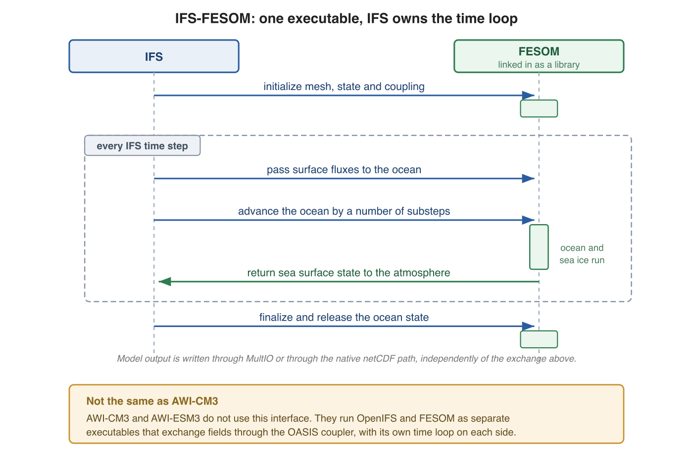

.. _fesom_as_library:

FESOM as a library (IFS interface)
**********************************

FESOM can be built as a library and called as a subroutine from ECMWF's IFS,
so that atmosphere and ocean run inside a single executable. This is the
interface used by the ECMWF IFS-FESOM coupled model line, including the
nextGEMS and Destination Earth simulations. The IFS driver owns the time loop
and calls FESOM through a small set of entry points in ``src/ifs_interface/``.

.. important::
   AWI-CM3 and AWI-ESM3 do not use this interface. They couple OpenIFS and
   FESOM as two separate executables that exchange fields through OASIS
   (``src/cpl_driver.F90``, enabled with the ``FESOM_COUPLED`` and
   ``OIFS_COUPLED`` cmake switches). Everything on this page applies only to
   the single-executable IFS-FESOM configurations.

Building the library
====================

The cmake build always creates a ``fesom`` library, and the standalone
``fesom.x`` is a thin executable linked against it. The switches below only
control whether the IFS entry points are compiled into that library:

- **ENABLE_IFS_INTERFACE=OFF** compile the ``src/ifs_interface/`` sources into
  the library so IFS can call FESOM as a subroutine.
- **BUILD_FESOM_AS_LIBRARY** deprecated alias for ``ENABLE_IFS_INTERFACE``,
  kept for older build scripts. It only sets the default of the new switch.
- **BUILD_SHARED_LIBS=ON** build ``fesom`` as a shared library, which is what
  the IFS build environments expect. Set to ``OFF`` for a static library.
- **ENABLE_MULTIO** route model output through ECMWF's MultIO layer instead of
  FESOM's native netCDF output. Only meaningful together with
  ``ENABLE_IFS_INTERFACE``; when the IFS interface is on, it defaults to
  ``ON`` if a MultIO installation is found. The MultIO library must provide
  its Fortran API (the ``multio-fapi`` target).

A typical configure line is::

    cmake .. -DENABLE_IFS_INTERFACE=ON -DENABLE_MULTIO=ON

The interface code
==================

``src/ifs_interface/`` was adapted from the corresponding NEMO code at ECMWF,
and the entry points keep their NEMO names (prefix ``nemogcmcoup_``) so that
IFS can drive FESOM without changes on the atmospheric side:

- ``ifs_interface.F90`` the entry points called by IFS.
- ``ifs_modules.F90`` and ``ifs_notused.F90`` support modules and stubs
  required to satisfy the NEMO-shaped interface.
- ``mpp_io.F90`` splits the MPI communicator into compute tasks and IO server
  tasks at startup.
- ``iom.F90`` the MultIO output manager, compiled only with
  ``ENABLE_MULTIO``.

The call sequence follows the usual init, step, finalize pattern. During
initialization IFS first sets up the IO servers, then calls an init routine
that wraps ``fesom_init`` and a coupling init that establishes the parallel
interpolation between the two grids. Every IFS time step then makes one step
call, which advances FESOM by the required number of ocean substeps through
``fesom_runloop``, surrounded by get and update calls that exchange surface
fields with the atmosphere. At the end of the run a finalize call wraps
``fesom_finalize`` and shuts the IO servers down. :numref:`ifs_fesom_callseq`
summarises the sequence.

.. _ifs_fesom_callseq:

   Call sequence of an IFS-FESOM run. IFS owns the time loop and calls into the
   FESOM library, which is linked into the same executable: once to initialize,
   then on every atmospheric time step to pass the surface fluxes, to advance
   the ocean by a number of substeps and to receive the sea surface state, and
   once more to finalize. AWI-CM3 does not work this way, as described above.

Output through MultIO
=====================

With ``ENABLE_MULTIO`` the fields selected for output are handed to MultIO
server tasks, which write GRIB or other formats defined by the MultIO
configuration, instead of being written to FESOM's native netCDF files. The
``&io`` sections of ``namelist.io`` still define which fields are written and
how often, as described in :ref:`chap_output_configuration`; only the backend
that receives the data changes.

Relevance for standalone users
==============================

A standalone FESOM user will almost never touch any of this. The library
build is the default and changes no standalone behaviour: ``fesom.x`` runs
exactly as before, and with ``ENABLE_IFS_INTERFACE=OFF`` (the default) none
of the interface code is compiled.
