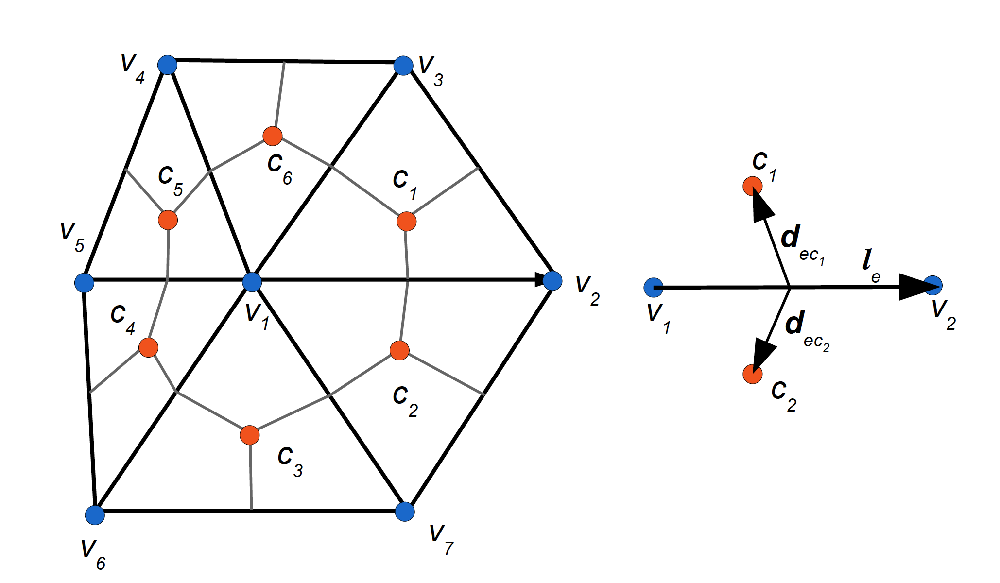
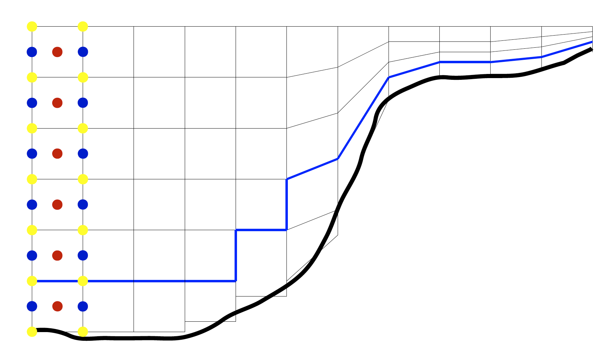

.. _geometry:

Geometry
********

The placement of variables
==========================

FESOM2 uses a cell-vertex placement of variables in the horizontal directions. The 3D mesh structure is defined by the surface triangular mesh and a system of (moving) level surfaces which split a triangular column in a set of smaller triangular prisms bounded by levels. In a horizontal plane, the horizontal velocities are located at cell (triangle) centroids, and scalar variables are at mesh (triangle) vertices. The vector control volumes are the prisms based on mesh surface cells, and the prisms based on median-dual control volumes are used for scalars (temperature, salinity, pressure and elevation). The latter are obtained by connecting cell centroids with edge midpoints, as illustrated in :numref:`labelgeometry`. The same cell-vertex placement of variables is also used in FVCOM :cite:`FVCOM`, however FESOM2 differs in almost every numerical aspect, including the implementation of time stepping, scalar and momentum advection and dissipation (see below).

.. _labelgeometry:

   Schematic of cell-vertex discretization (left) and the edge-based structure (right). The horizontal velocities are located at cell (triangle) centers (red circles) and scalar quantities (the elevation, pressure, temperature and salinity) are at vertices (blue circles). The vertical velocity and the curl of horizontal velocity (the relative vorticity) are computed at the scalar locations too. Scalar control volumes (here the volume around vertex :math:`v_1` is shown) are obtained by connecting the cell centers with midpoints of edges. Each cell is characterized by the sets of its vertices :math:`V(c)` which is :math:`(v_1,v_2,v_3)` for :math:`c=c_1` and the set of its nearest neighbors :math:`N(c)`. For :math:`c=c_1`, :math:`N(c)` includes :math:`c_2`, :math:`c_6` and a triangle (not shown) across the edge formed by :math:`v_2` and :math:`v_3`. One can also introduce :math:`C(v)` which is :math:`(c_1,c_2,c_3,c_4,c_5,c_6)` for :math:`v=v_1`, and other possible sets. Edge :math:`e` (right panel) is characterized by the set of its vertices :math:`V(e)=(v_1,v_2)` and the ordered set of cells :math:`C(e)=(c_1,c_2)` with :math:`c_1` on the left. The edge vector :math:`{\bf l}_e` connects vertex :math:`v_1` to vertex :math:`v_2`. The edge cross-vectors :math:`{\bf d}_{ec_1}` and :math:`{\bf d}_{ec_2}` connect the edge midpoint to the respective cell centers.

In the vertical direction, the horizontal velocities and scalars are
located at mid-levels. The velocities of inter-layer exchange (vertical velocities for flat layer surfaces) are located at full layers and at scalar points. :numref:`vertical` illustrates this arrangement.

The layer thicknesses are defined at scalar locations (to be consistent with the elevation). There are also auxiliary layer thicknesses at the horizontal velocity locations. They are interpolated from the vertex layer thicknesses.

.. _vertical:

   Schematic of vertical discretization. The thick line represents the bottom, the thin lines represent the layer boundaries and vertical faces of prisms. The location of variables is shown for  the left column only. The blue circles correspond to scalar quantities (temperature, salinity, pressure), the red circles to the horizontal velocities and the yellow ones to the vertical exchange velocities. The bottom can be represented with full cells (three left columns) or partial cells (the next two). The mesh levels can also be terrain following, and the number of layers may vary (the right part of the schematic). The layer thickness in the ALE procedure may vary in prisms above the blue line. The height of prisms in contact with the bottom is fixed.

The cell-vertex discretization of FESOM2 can be viewed as an analog of an Arakawa B-grid (see also below) while that of FESOM1.4 is an analog of A-grid. The cell-vertex discretization is free of pressure modes, which would be excited on the A-grid unless stabilized. However, the cell-vertex discretization allows spurious inertial modes because of excessively many degrees of freedom used to represent the horizontal velocities. They need to be filtered by the horizontal viscosity. Triangular A and B grids work on arbitrary triangular meshes in contrast to C-grids which require orthogonal meshes.

Notation
========

For convenience of model description we introduce the following notation.
Quantities defined at cell centroids will be denoted with the lower index :math:`c`, and the quantities at vertices will be denoted with the lower index :math:`v`. The vertical index :math:`k` will appear as the first index, but it will be suppressed if this does not lead to ambiguities. The agreement is that the layer index increases downwards. The indices may appear in pairs or in triples. Thus the pair :math:`kc` means the vertical layer (or level for some quantities) :math:`k` and cell :math:`c`, and the triple :math:`kcv` means that the quantity relates to layer (level) :math:`k`, cell :math:`c` and vertex :math:`v` of this cell. We use the notation :math:`C(v)` for the set of cells that contain vertex :math:`v`, :math:`V(c)` for the set of vertices of cell :math:`c`, :math:`E(v)` for the set of edges emanating from vertex :math:`v` and so on. Each edge :math:`e` is characterized by its vertices :math:`V(e)`, the neighboring cells :math:`C(e)`, the length vector :math:`{\bf l}_e` directed from the first vertex in :math:`V(e)` to the second one and two cross-edge vectors :math:`{\bf d}_{ec}` directed from the edge center to the cell center of the left and right cells respectively (see :numref:`labelgeometry`). The cells in the set :math:`C(e)` are ordered so that the first one is on the left of the vector :math:`{\bf l}_e`. The boundary edges have only one (left) cell in the set :math:`C(e)`. The total number of vertices, cells and edges will be denoted as :math:`V, C, E` respectively.

Earth sphericity
================

We use spherical coordinate system with the north pole displaced to Greenland (commonly 75°N, 50°W). A local Carthesian reference frame is used on each cell with cellwise-constant metric coefficients (cosine of latitude). Gradients of scalar quantities and cell areas are computed with respect to local coordinates. The vectors :math:`{\bf d}_{ec}` are stored in local physical measure of respective cells :math:`c` for they always enter in combination with velocity (defined on cells) to give normal transports. Vectors :math:`{\bf l}_e` are stored in radian measure. Whenever their physical length is required, it is computed based on the mean of cosines on :math:`C(e)`. We will skip other details of spherical geometry (metric terms in momentum advection etc.) and ignore the difference in the representation of :math:`{\bf l}_e` (radian measure) and :math:`{\bf d}_{ec}` (physical measure) for brevity below. The :math:`x` and :math:`y` directions should be understood as local zonal and meridional directions.

In contrast to regular-mesh models there is no cyclic boundary in FESOM meshes which commonly cover the entire ocean.

Bottom representation
=====================

The bottom topography is commonly specified at scalar points because the elevation is defined there. However, for discretizations operating with full velocity vectors, this would imply that velocity points are also at topographic boundaries. In this case the only safe option is to use the no-slip boundary conditions, similar to the traditional B-grids. To avoid this constraint, we use the cellwise representation of bottom topography (same as in FESOM1.4). In this case velocity points never touch bottom and both no-slip and free slip boundary conditions are possible. Boundary conditions are implemented through ghost cells which are obtained from the boundary elements by reflection with respect to the boundary face (edge in 2D).

The drawback of the elementwise bottom representation is that the total thickness is undefined at scalar points if the bottom is stepwise (geopotential vertical coordinate). The motion of level surfaces of the ALE vertical coordinate at each scalar location is then limited to the layers that do not contact the bottom topography (above the blue line in :numref:`vertical`). This is related to the implementation of partial cells which is much simpler if the thickness of the bottom layer stays fixed.
The layer thickness :math:`h_{kv}` is dynamically updated at scalar points (vertices) in the layers that are affected by the ALE algorithm and interpolated to the cells

.. math::
   h_{kc}=(1/3)\sum_{v\in V(c)}h_{kv}.

The cell thicknesses :math:`h_{kc}` enter the discretized equations as the products with horizontal velocities.

Because of cell-wise bottom representation, triangular prisms pointing into land (two lateral faces touch the land) may occur at certain levels on *z*-coordinate meshes even though such prisms were absent along the coast. Such prisms lead to instabilities in practice and have to be excluded. The opposite situation with land prisms pointing into the ocean is much less dangerous, yet it is better to avoid it too. We adjust the number of layers under each surface triangle at the stage of mesh design to exclude such potentially dangerous situations. This issue is absent in FESOM1.4 because of the difference in the placement of horizontal velocities and the necessity to use no-slip boundary conditions. Since the number of cells is nearly twice as large as the number of vertices, the cell-wise bottom representation may contain more detail than can be resolved by the field of vertical velocity. This may trigger extra noise in layers adjacent to the bottom.

Partial cells
=============

Partial cells on *z*-coordinate meshes are naturally taken into account in the ALE formulation (see below) because it always deals with variable layer thicknesses (heights of prisms). If :math:`K_{c}` is the number of layers under cell :math:`c`, we define

.. math::
   K_{v}^+=\max_{c\in C(v)}K_{c},\quad K_{v}^-=\min_{c\in C(v)}K_{c}.

If the layer thickness are varied in the ALE procedure, this is limited to :math:`K_{v}^--1` layers. With this agreement, the thickness of the lowest layer on cells is kept as initially prescribed. In this case the implementation of partial cells reduces to taking the thicknesses of the lowest layers on cells as dictated by the bottom topography unless they are too thick (the real depth is deeper than the deepest standard level by more than half thickness of the last standard layer), in which case we bound them. The heights of scalar control prisms in the layers below :math:`K_{v}^-` are formally undefined, but their volumes are strictly defined, and thicknesses can be considered as the volume-mean ones if needed. Scalar and vector quantities defined at mid-layers are kept at their standard locations. This avoids creating spurious pressure gradients. The partial cells then work through the modified transports crossing the faces of control volumes. Since the horizontal velocities are located at cells, the transports entering scalar control volumes are uniquely defined. For vector control volumes the areas of vertical faces may be different on two prisms meeting through the face. Taking the minimum area to compute fluxes is the safest option in this case.

