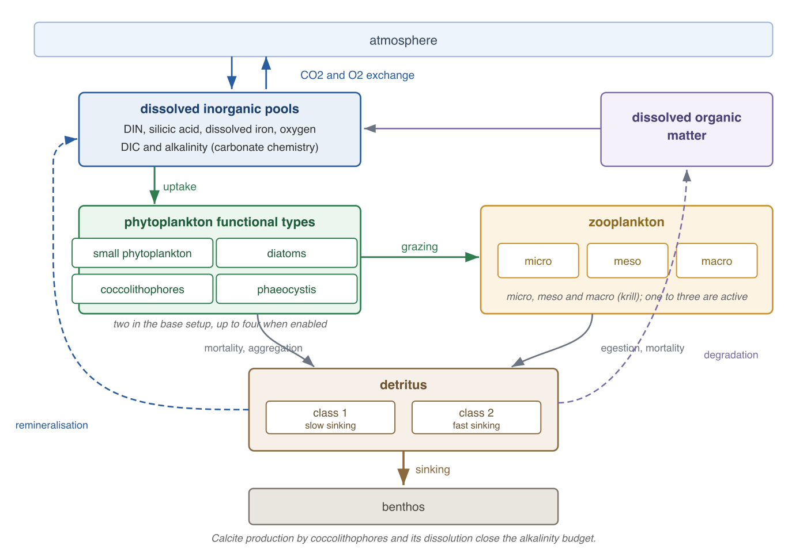

.. _recom_in_fesom:

REcoM biogeochemistry configuration
***********************************

This section describes how to build and configure FESOM2 with the Regulated Ecosystem Model (REcoM3), the ocean biogeochemistry component of FESOM2. The focus is on the practical workflow, not on the underlying science; for the scientific background please consult the model description literature referenced by the `REcoM repository <https://github.com/RECOM-Regulated-Ecosystem-Model/REcoM>`_ on GitHub.

General information
===================

REcoM3 is a marine ecosystem and biogeochemistry model of intermediate complexity that simulates the coupled cycles of carbon, nitrogen, silicic acid, iron and oxygen. The ecosystem is described by phytoplankton functional types with variable stoichiometry (small phytoplankton and diatoms in the base configuration, optionally extended by coccolithophores and phaeocystis), by up to three zooplankton groups and up to two detritus classes with different sinking speeds, and by a full carbonate chemistry solved with the mocsy package, which also provides the air-sea fluxes of CO2 and oxygen. All biogeochemical quantities are ordinary FESOM2 tracers: they are advected and mixed by the standard tracer machinery and only their sources, sinks and sinking are computed by REcoM. Depending on the configuration this adds between 22 and 36 tracers to the simulation, which increases the cost of a run accordingly. :numref:`recom_structure` shows how the compartments are connected.

.. _recom_structure:

   Structure of the REcoM3 ecosystem. Phytoplankton functional types take up
   the dissolved inorganic pools and are grazed by one to three zooplankton
   groups. Mortality, aggregation and egestion feed two detritus classes that
   sink towards the benthos, while remineralisation, including that of the
   material collected in the benthos, and the degradation of dissolved
   organic matter return the nutrients to the dissolved pools. The
   carbonate chemistry links the dissolved inorganic carbon and alkalinity
   pools to the air-sea exchange of CO2.

The REcoM source code lives in ``src/recom`` as a git submodule that points to the separate `REcoM repository <https://github.com/RECOM-Regulated-Ecosystem-Model/REcoM>`_. It contains the biogeochemical source-minus-sink routines, the sinking scheme, the carbonate chemistry driver and the mocsy library itself.

Compilation
===========

After cloning FESOM2, fetch the REcoM submodule and enable the corresponding CMake flag::

    git submodule update --init src/recom
    ./configure.sh -DRECOM_COUPLED=ON

``RECOM_COUPLED`` is defined in the top level ``CMakeLists.txt`` and is ``OFF`` by default. The additional flag ``CISO_COUPLED`` compiles the carbon isotope extension and only works together with an active ``RECOM_COUPLED``.

Configuration with namelist.recom
=================================

All REcoM settings are collected in ``namelist.recom``, which must be present in the ``work`` directory next to the other namelists. The file is organized in thematic groups rather than one large list:

- **&nam_rsbc** paths to the surface boundary condition files (dust, aeolian nitrogen, riverine and erosion input, atmospheric CO2), see `Input files`_ below.
- **&parecomsetup** the two switches ``enable_3zoo2det`` and ``enable_coccos`` that select the ecosystem complexity, and thereby the number of biogeochemical tracers.
- **&pavariables** the main control group: tracer counts (``bgc_num``), sinking velocities, process switches such as ``O2dep_remin`` or ``use_ballasting``, the input path ``REcoMDataPath``, and the handling of atmospheric CO2 over forcing cycles.
- Process parameter groups, one per topic, for photosynthesis, nutrient assimilation and limitation, the zooplankton groups and their grazing preferences, aggregation, iron chemistry, calcification and dissolution, ballasting, benthos decay rates, air-sea gas exchange and alkalinity restoring.
- **&paciso** the carbon isotope settings, only relevant when compiled with ``CISO_COUPLED``.

The individual parameters are documented by comments in the shipped configuration files, which act as the reference catalog; this page intentionally does not duplicate them.

Tracer list in namelist.tra
"""""""""""""""""""""""""""

The biogeochemical tracers are registered in the ``&tracer_list`` of ``namelist.tra`` with tracer IDs from 1001 upwards, next to temperature and salinity. The number of listed tracers must match the chosen ecosystem configuration (``num_tracers`` in ``&tracer_listsize`` and ``bgc_num`` in ``namelist.recom``), otherwise the model stops with a tracer count error at startup. Initial conditions are assigned in ``&tracer_init3d`` by pairing tracer IDs with netCDF files and variable names, for example::

    &tracer_init3d
    n_ic3d   = 8
    idlist   = 1019, 1022, 1018, 1003, 1002, 1001, 2, 1
    filelist = 'fe5deg.nc', 'oxy5deg.nc', 'si5deg.nc', 'talk5deg.nc', 'tco2_5deg.nc', 'din5deg.nc', 'woa18_netcdf_5deg.nc', 'woa18_netcdf_5deg.nc'
    varlist  = 'Fe', 'oxygen_mmol', 'i_an', 'TAlk_mmol', 'TCO2_mmol', 'n_an', 'salt', 'temp'
    /

Here dissolved inorganic carbon and alkalinity come from a GLODAP climatology, while nutrients and oxygen come from World Ocean Atlas type fields. Working examples are provided in the ready-made setups described below and in ``test/input/recom``.

Ready-made setups
=================

The directory ``config`` contains four complete namelist sets for the supported ecosystem configurations, in the folders ``bin_2p1z1d``, ``bin_2p3z2d``, ``bin_3p3z2d`` and ``bin_4p3z2d``. The naming encodes the number of phytoplankton, zooplankton and detritus groups: ``2p1z1d`` runs small phytoplankton and diatoms with one zooplankton and one detritus class, ``2p3z2d`` extends this to three zooplankton groups (mesozooplankton, macrozooplankton and microzooplankton) and two detritus classes, ``3p3z2d`` adds coccolithophores as a third phytoplankton group, and ``4p3z2d`` additionally activates phaeocystis. Each folder holds a matching ``namelist.recom`` together with the other namelists, so the easiest way to start is to copy one of these folders and adapt the paths.

.. note::
   When switching between the setups, ``namelist.recom`` and ``namelist.tra`` have to be changed consistently, since every additional functional group brings its own tracers.

Input files
===========

Beyond the standard FESOM2 input, REcoM needs a small set of additional files. The paths are set in ``&nam_rsbc`` and via ``REcoMDataPath`` in ``namelist.recom``:

- Initial condition climatologies for the dissolved tracers, read through ``namelist.tra`` as shown above.
- A monthly dust deposition climatology providing the iron input at the surface (fields based on Albani or Mahowald, selected with ``fe_data_source`` and the ``UseDustClim*`` switches).
- An atmospheric CO2 record for simulations with time-varying CO2 (``constant_CO2=.false.``); with ``constant_CO2=.true.`` the value ``CO2_for_spinup`` is used instead.
- Optional aeolian nitrogen deposition, riverine input and erosion input files, activated with the corresponding ``use*`` switches in ``&pavariables``.

A minimal working example, including all input files on a coarse test mesh, is shipped with the repository in ``setups/test_pi_recom`` and ``test/input/recom`` and is exercised by the continuous integration.
